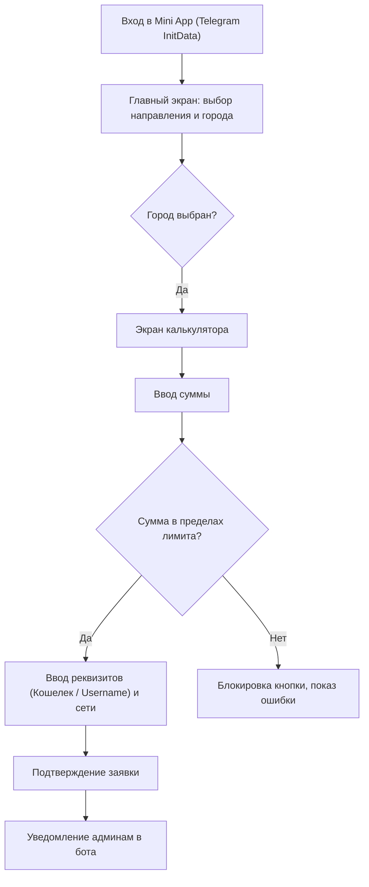

## 1. Обзор продукта
Telegram Web App (Mini App) для обмена валют P2P (Наличные ⇄ USDT и EUR ⇄ USDT).
- Основная цель: предоставление пользователям удобного интерфейса для создания заявок на обмен валюты с автоматическим расчетом по актуальному курсу и комиссии (4%).
- Целевая аудитория: активные пользователи Telegram, криптоэнтузиасты, нуждающиеся в быстром и понятном P2P-обмене.

## 2. Ключевые функции

### 2.1 Пользовательские роли
| Роль | Способ регистрации | Основные права |
|------|--------------------|----------------|
| Клиент | Telegram InitData | Создание заявок на обмен, просмотр курсов |
| Администратор | Telegram Admin Bot | Управление городами, лимитами, курсами, прием заявок |

### 2.2 Функциональные модули
1. **Главный экран (Входной)**: Авторизация, выбор направления обмена (Наличные/USDT, EUR/USDT), выбор города.
2. **Калькулятор обмена**: Расчет получаемой/отдаваемой суммы, валидация лимитов города.
3. **Подтверждение заявки**: Ввод реквизитов (кошелек/контакт), выбор сети для USDT, создание заявки.

### 2.3 Детали страниц
| Название страницы | Модуль | Описание функционала |
|-------------------|--------|----------------------|
| Главный экран | Авторизация | Автоматический вход через Telegram Web Apps SDK. |
| Главный экран | Выбор направления | Переключатели: [ Отдаю Наличные ] / [ Отдаю USDT ]. Выбор города из списка. |
| Калькулятор обмена | Калькулятор | Поля ввода сумм. Логика расчета стоимости с учетом 4% комиссии. Для EUR - округление до 10/20/50, запрет дробных. |
| Калькулятор обмена | Валидация | Проверка суммы на доступный лимит фиата/EUR в городе. Ошибка при превышении. |
| Ввод реквизитов | Реквизиты | USDT: адрес кошелька, выбор сети (TRC-20, ERC-20, TON). Наличные: @username. |
| Ввод реквизитов | Подтверждение | Итоговая карточка сделки, кнопка "Создать заявку" с Taptic Engine откликом. |

## 3. Основной процесс
Пользователь открывает Mini App. Выбирает направление обмена и город. Вводит сумму (калькулятор производит перерасчет и проверяет лимиты). Заполняет реквизиты. Создает заявку. Заявка отправляется в Telegram-бот администраторам.

## 4. Дизайн интерфейса (UX/UI)
### 4.1 Стиль дизайна
- Концепция: «Зумерский премиум» (Dark mode).
- Цветовая палитра: Фон - глубокий черный/графитовый (#0B0B0C). Акцентный цвет - кислотно-зеленый (#00FF66) или ярко-фиолетовый. Текст - белый.
- Стиль кнопок: Скругление углов border-radius: 16px или 24px.
- Шрифты: Крупные, читаемые, современные sans-serif (Inter/SF Pro/Space Grotesk).
- Анимации: Скелетоны при загрузке, плавные переходы, отсутствие лишних кликов, тактильный отклик (Taptic Engine).

### 4.2 Обзор дизайна страниц
| Название страницы | Модуль | Элементы UI |
|-------------------|--------|-------------|
| Главная | Выбор | Крупные переключатели, выпадающий список городов, скелетоны. |
| Калькулятор | Ввод | Крупные поля ввода, неоновые акценты на активных полях. |
| Реквизиты | Сеть | Зумерские чип-кнопки выбора сети с указанием времени (TRC-20, TON). |
| Реквизиты | Итог | Итоговая карточка (Сумма, курс), яркая кнопка подтверждения. |

### 4.3 Адаптивность
- Mobile-first, оптимизация под мобильные устройства в рамках Telegram Mini App, touch-оптимизация.
