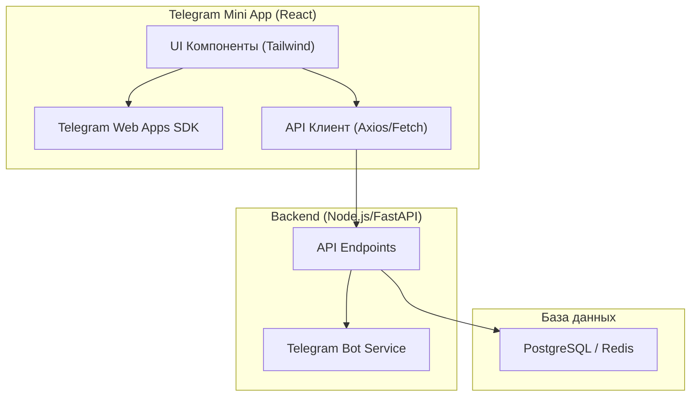
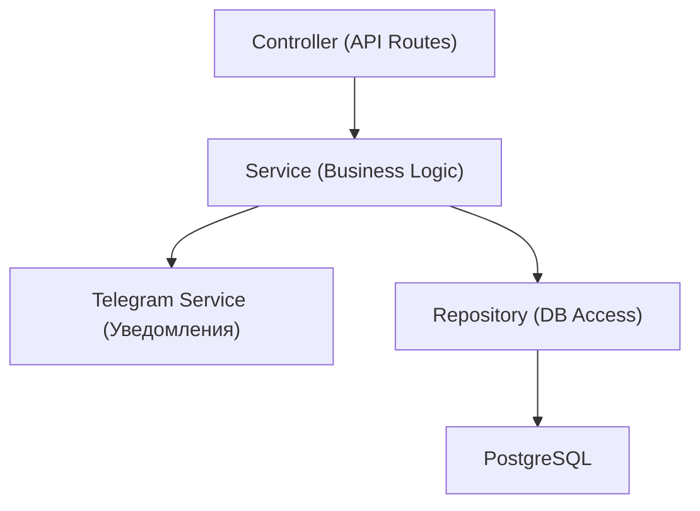
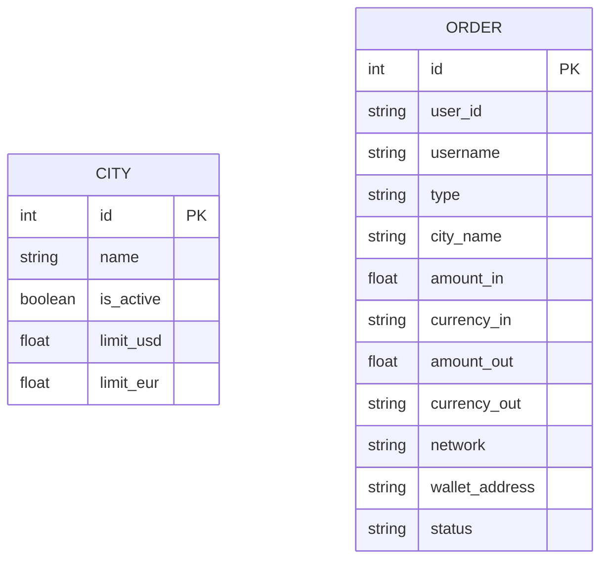

## 1. Архитектурный дизайн

## 2. Описание технологий
- Frontend: React@18 + TailwindCSS@3 + Vite + Telegram Web Apps SDK (@twa-dev/sdk).
- Инструмент инициализации: vite (React + TypeScript).
- Backend (рекомендуемый, моки на клиенте для прототипа): Node.js (Express/FastAPI), PostgreSQL.
- Интеграция: Telegram Bot API для уведомлений администраторов.

## 3. Определение маршрутов (Frontend)
| Маршрут | Назначение |
|---------|------------|
| `/` | Главный экран: выбор направления обмена и города |
| `/calculator` | Экран калькулятора обмена |
| `/checkout` | Экран ввода реквизитов и подтверждения заявки |

## 4. Определение API (Backend)
- `POST /api/auth/verify` - Валидация Telegram InitData.
- `GET /api/cities` - Получение списка городов и их лимитов (USD, EUR).
- `GET /api/rates` - Получение актуального курса валют (USDT/USD, USDT/EUR).
- `POST /api/orders` - Создание новой заявки на обмен.

## 5. Диаграмма архитектуры сервера

## 6. Модель данных
### 6.1 ER Диаграмма

